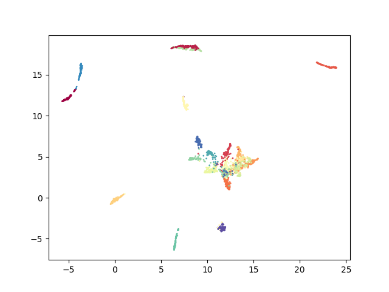

### Fine-tuning Sentence-Transformers for Multi-class Language Identification Task with PyTorch Lightning

This repository is for language identification using [SentenceTransformer](https://www.sbert.net/index.html), a pre-trained transformer-based model for natural language processing. 

A list of SentenceTransformer pre-trained models can be found [here](https://www.sbert.net/docs/pretrained_models.html)

I specifically used the [task-agnotic (English) pre-trained SentenceTransformer model](https://arxiv.org/pdf/2002.10957.pdf) to extract features from 100 documents per language and trained a single linear classifier on the extracted features.


Figure: Architecture for the approach. A pre-trained SentenceTransformer transforms the documents and to train a single linear classifier.

Python version: Python 3.10.8

## Train from Scratch

1. Clone the repo:
```
git clone kayodeolaleye/multilang-identification
cd ./multilang-identification
```
2. Install requirements:
```
pip install -r requirements.txt
```
3. Train the model:
```
python training.py --model_name all-MiniLM-L6-v2 --epochs 1000 --batch_size 32
```

#### Embeddings from pre-trained models: all-mini-LM-L6-v2 and (all-mini-LM-L12-v2 respectively
<p float="left">
  
  
</p>

#### Learning curves for the single Linear Classifier

<p float="left">
  
  
</p>
<p float="left">
  
  
</p>

### ToDo: Example Usage

<p align="center">
    <a href="https://colab.research.google.com/github/kayodeolaleye/multilang-identification/blob/main/Multilang_identification.ipynb" target="_parent"></a>
</p>
Add code snippets for loading the model weights and assessing performance on test samples

```python
# import torch

# # download pretrained weights (and optionally move to GPU)
# url = 'https://github.com/kayodeolaleye/multilang-identification/blob/main/model.pt'
# filename = wget.download(url)

# # Load the model weight
# model = torch.load(filename).to('cuda')

# doc = ...

# with torch.no_grad():
    
```    